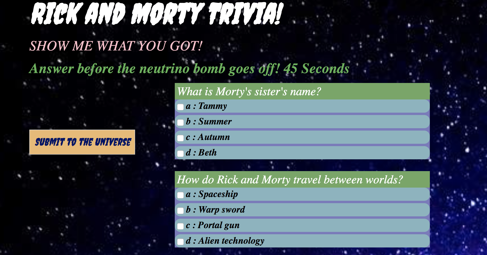
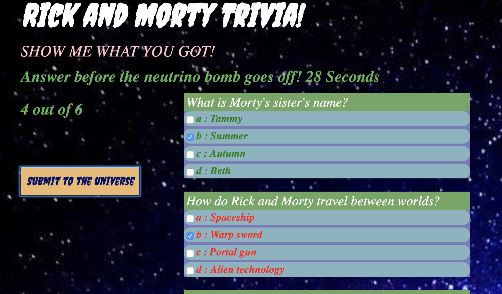
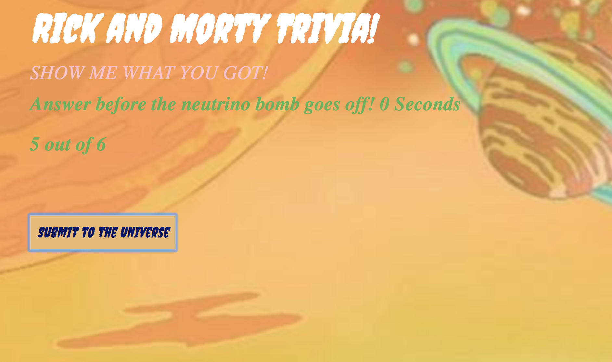

# TriviaGame
Rick and Morty Trivia Game

## Rick and Morty TV Show Trivia Game

Created during KU Coding Bootcamp. The challenge was to create a timed trivia game. 60 seconds were given to answer all questions. After the user completes the quiz and clicks the submit button, the score is revealed. 

## Technologies used
- Google Fonts
- Bootstrap
- jQuery
- JavaSCript
- HTML
- CSS

## Screenshots

Score with incorrect answers displayed in red

Times up screen dispaying answers completed